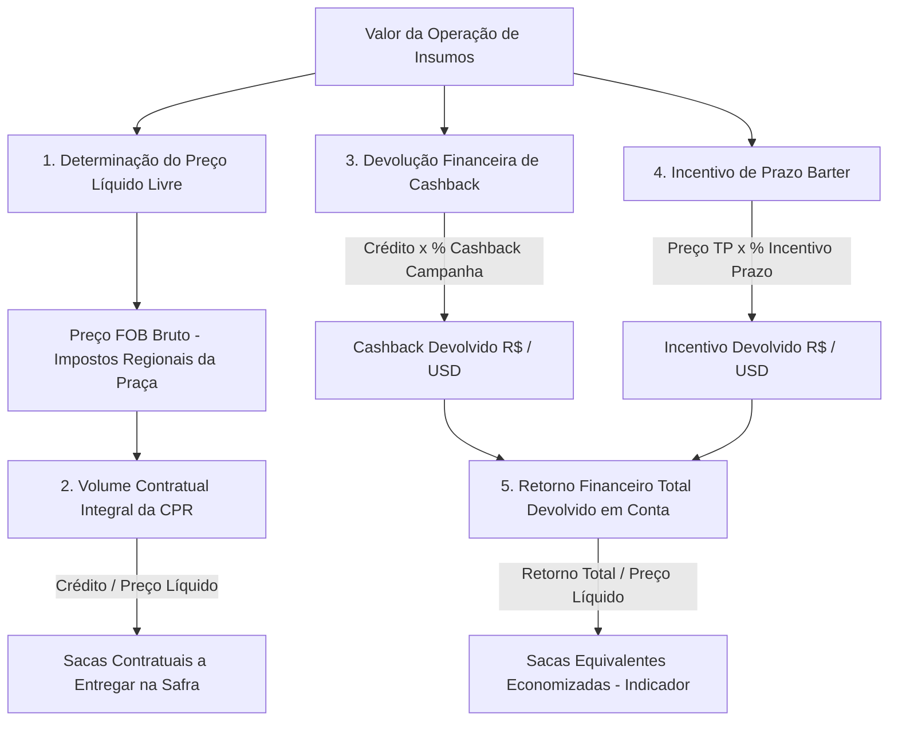
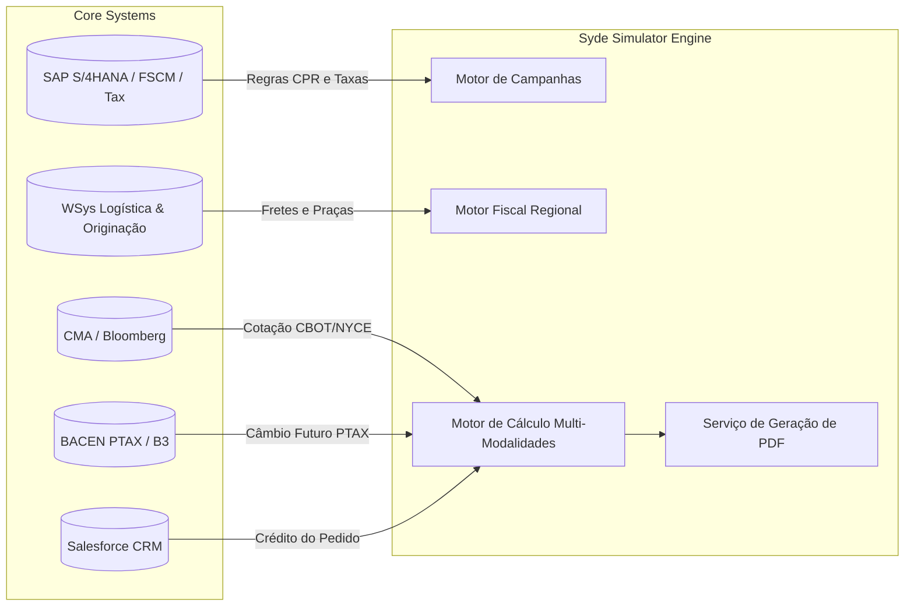

# PRD_SYDE-31 – Simulador de Taxas: Modalidade Barter (Nutrade) e Comparativo Multi-Modalidades

**Versão:** v1.0 (Consolidada para Engenharia)  
**Data:** 31 de agosto de 2026  
**Status Atual:** Especificação Funcional e Técnica para Desenvolvimento (Ready for Dev)  
**Referência Cruzada:** PRD_FIN-12453 | Card Jira: SYDE-31  
**Protótipo Funcional:** [josuejofre.github.io/barter-simulator](https://josuejofre.github.io/barter-simulator)

---

## 📋 Changelog do Documento

| Versão | Data | Autor / Origem | Principais Alterações |
|---|---|---|---|
| **v0.1** | 29/07/2026 | Product Discovery | Primeira versão do PRD em fase de discovery inicial. |
| **v0.2** | 29/07/2026 | Product Discovery | Inclusão de referências ao protótipo, planilha de teste de mesa e consolidação preliminar de regras. |
| **v0.3** | 29/07/2026 | Discovery / Negócio | Ajustes de escopo para incluir Barter Nutrade e Outras Tradings, fluxo revisado, obrigatoriedade de commodity/praça e dados logísticos WSys. |
| **v1.0** | **31/08/2026** | **Engenharia & Negócio (Ata 21/08)** | **Consolidação definitiva das Regras de Negócio para Engenharia:** 1. **Mecânica de Cashback:** Cashback não deduz sacas da CPR física; o produtor entrega o volume integral dos insumos e recebe a devolução financeira em conta ($ e R$). 2. **5 Modalidades Ativas:** Barter (Nutrade), Syde (FIDC), Fiso (Bancário), Syngenta (On-Balance) e CRA Agro / Banco Parceiro. 3. **Mapeamento de Campanhas:** Estrutura completa de campanhas (*Sul Repique*, *Cerrado 2026/27*) e subcategorias (*PR/MS, RS/SC Silver, Black, Black+, Bio*). 4. **Matriz Tributária:** Atualização do motor fiscal (Funrural $1{,}63\%$, Fethab/IAGRO MT, Fundems MS, Fundeinfra GO, FDI PI). 5. **Flexibilidade Logística:** Suporte a simulação com frete zero (KM 0). 6. **Identificação de Fontes:** Parametrização dos campos originados do cadastro de campanha (`* Fonte: Cadastro de campanha`). |

---

## 1. Contexto & Oportunidade

O simulador de crédito do ecossistema **Syde** apoia negociações comerciais ao comparar modalidades de financiamento ao produtor rural. Historicamente, a modalidade **Barter** (especialmente na estrutura de originação **Nutrade**) dependia de cálculos paralelos, planilhas descentralizadas e argumentação manual por parte dos RTVs e consultores comerciais.

A evolução do produto formaliza o motor de cálculo do Barter de forma nativa, permitindo a comparação auditável entre as **5 modalidades de crédito** ativas no ecossistema Syngenta/Syde, demonstrando com total transparência o ganho financeiro e a equivalência física em sacas.

---

## 2. Problema de Negócio

Antes desta padronização, observavam-se quatro dores operacionais críticas:
1. **Dificuldade de Comparação:** Ausência de um comparador unificado entre operações estruturadas em grãos (Barter) e instrumentos financeiros puros (FIDC, Bancário, On-Balance e CRA).
2. **Dependência de Planilhas Manuais:** Risco de erros em cálculos tributários regionais (Fethab, Fundems, Senar) e no rebate de juros/cashback.
3. **Inconsistência na Comunicação:** Dificuldade em tangibilizar que o cashback de Barter é um retorno financeiro em dinheiro, e não uma redução antecipada de sacas na CPR física.
4. **Baixa Visibilidade do Custo Efetivo:** Falta de clareza sobre o Custo Real Total (%) e a Taxa Mensal Efetiva (% a.m.) ponderada por modalidade.

---

## 3. Objetivos do Produto

### Objetivo Principal
Disponibilizar no Simulador Syde a simulação nativa e parametrizada da modalidade **Barter (Nutrade)** integrada com as demais 4 modalidades financeiras (**Syde**, **Fiso**, **Syngenta** e **CRA Agro**), ordenando os resultados pelo melhor benefício econômico para o produtor rural.

### Objetivos Específicos
- Suportar simulação em **Real (BRL)** e **Dólar (USD)** com preservação da base física de grãos.
- Integrar **motor fiscal de tributação regional** por estado e praça logística.
- Calcular a **devolução financeira de cashback** e **incentivo de prazo** sem alterar o volume físico contratual da CPR.
- Comparar o **Custo Real Total (%)** e **Custo Real da Operação (% a.m.)** de todas as modalidades.
- Gerar exportação de proposta comparativa em **PDF** e link de compartilhamento.

---

## 4. Personas & Usuários Impactados

| Persona | Objetivo Principal | Dor Mitigada pelo PRD |
|---|---|---|
| **RTV / Consultor Comercial** | Apresentar a melhor opção de crédito/pagamento durante a negociação de insumos com o produtor rural. | Elimina o uso de planilhas paralelas; fornece argumentação matemática auditada e comparativo visual instantâneo. |
| **Mesa de Barter & Originação (Nutrade)** | Garantir que as taxas, cashbacks de campanha e regras tributárias das praças estejam rigorosamente corretos. | Parametrização centralizada no cadastro de campanhas e no catálogo de praças (WSys). |
| **Produtor Rural** | Entender claramente quanto pagará, qual o volume de grãos a entregar e quanto receberá de devolução financeira. | Transparência total sobre o volume da CPR e o valor financeiro do cashback creditado em conta. |
| **Backoffice de Crédito & Finanças** | Monitorar a aderência das propostas às políticas de garantias e risco por produto financeiro. | Regras claras de colaterais (CPR Física, NP, Cessão) e apuração do Custo Real da Operação. |

---

## 5. Requisitos Funcionais do Sistema

### 5.1. Consumo da Simulação (Frontend / Jornada do Usuário)
- **RF-01 (Seleção de Campanha e Subcategoria):** O usuário deve selecionar a campanha ativa (ex: *Sul Repique*, *Cerrado Safra 2026/27*, *Planilha 2026*) e a respectiva subcategoria (*PR/MS Silver*, *RS/SC Black*, *Bio*, etc.).
- **RF-02 (Data de Carência, Vencimento e Prazo):** Ao selecionar a campanha/subcategoria, o sistema preenche automaticamente as datas de desembolso e vencimento, calculando o prazo em dias corridos e meses comerciais (/30).
- **RF-03 (Seleção de Commodity):** Suporte a Soja (sacas de 60 kg) e Algodão (libras-peso - lp). Obrigatório para Barter.
- **RF-04 (Seleção de Moeda):** Chave seletora entre **BRL (R$)** e **USD ($)**. Todas as entradas monetárias se adaptam à moeda escolhida; volumes físicos permanecem inalterados.
- **RF-05 (Valor da Operação):** Entrada do valor total dos insumos a financiar.
- **RF-06 (Estado e Praça Logística):** Seleção do estado e município/praça logística (dados integrados ao catálogo WSys).
- **RF-07 (Dedução Fiscal Ativa/Inativa):** Toggle para ligar/desligar a incidência de descontos tributários regionais para fins de análise de sensibilidade.
- **RF-08 (Parâmetros de Frete Flexíveis):** Distâncias em estrada de chão (KM) e asfalto (KM). O sistema deve permitir **KM zero** (frete R$ 0,00) sem travar a simulação.
- **RF-09 (Cotação da Commodity Futura):** Consumo automático do preço de referência com base no vencimento da campanha (ou cotação digitada/customizada).

### 5.2. Comparativo das 5 Modalidades de Crédito
O motor deve calcular e exibir os cards ordenados **da mais vantajosa (menor custo real total) para a menos vantajosa**:

1. **Barter (Nutrade):**
   - **Garantias:** CPR Física e Seguro Agrícola.
   - **Mecânica:** Entrega física integral de grãos na safra + devolução financeira de Cashback (% da campanha sobre o crédito) + Incentivo de prazo (% regressivo sobre o Preço TP).
2. **Syde (FIDC):**
   - **Garantias:** Nota Promissória ou CPR Financeira sem penhor.
   - **Mecânica:** Desconto VPAN à vista ($-4{,}0\%$ sobre o valor base) com juros compostos calculados em dias úteis (/22).
3. **Fiso (Bancário):**
   - **Garantias:** Sem garantia patrimonial (venda a prazo cedida a banco/parceiro).
   - **Mecânica:** Juros simples em dias corridos com rebate de incentivo comercial ($-1{,}0\%$).
4. **Syngenta (On-Balance):**
   - **Garantias:** Estrutura corporativa alinhada com o comitê de crédito Syngenta.
   - **Mecânica:** Faturamento a prazo sobre preço de tabela em balanço próprio, juros simples corridos (/30).
5. **CRA Agro / Banco Parceiro:**
   - **Garantias:** Cessão de Direitos Creditórios ou CPR Financeira.
   - **Mecânica:** Operação securitizada via mercado de capitais com taxa contratual ($1{,}70\%$ a.m.) e bonificação/incentivo comercial da campanha ($-2{,}0\%$).

### 5.3. Identificação de Origem dos Parâmetros
Todos os campos alimentados diretamente pela tabela da campanha (*Taxa mensal, Incentivo Barter, Cashback, Incentivo, Desconto VPAN*) devem conter a identificação visual `*` e o texto explicativo `Fonte: Cadastro de campanha` nos tooltips correspondentes.

### 5.4. Exportação e Compartilhamento
- **RF-10 (Geração de PDF):** O usuário pode marcar quais modalidades deseja incluir no documento e exportar o relatório consolidado em PDF.
- **RF-11 (Compartilhamento Digital):** Geração de link parametrizado com os dados da simulação para envio direto via WhatsApp/E-mail.

---

## 6. Especificação Matemática & Regras de Negócio Detalhadas

### 6.1. Motor de Cálculo de Barter (Nutrade)

#### Passo 1: Preço Líquido Livre da Commodity (Porteira)
$$\text{Preço Líquido} = \text{Preço Bruto FOB} - \text{Tributos Totais da Praça}$$
*Onde os tributos somam a alíquota percentual do Funrural/estaduais sobre a nota mais os impostos em valor fixo por saca.*

#### Passo 2: Volume Contratual a Entregar (CPR Física)
$$\text{Volume Físico Contratual (sacas)} = \text{Teto}\left(\frac{\text{Valor do Crédito dos Insumos}}{\text{Preço Líquido da Saca}}\right)$$
> [!IMPORTANT]
> **Regra da CPR Integral (Ata 21/08):** O volume de grãos a entregar fixado na CPR física **NÃO é reduzido** pelo cashback. O produtor compromete e entrega a totalidade das sacas para quitação de 100% da compra de insumos.

#### Passo 3: Preço Pedido TP (Valor Presente)
$$\text{Juros do Período} = \left(\frac{\text{Prazo em Dias}}{360}\right) \times \left(\frac{\text{Taxa Anual Barter \%}}{100}\right)$$
$$\text{Preço Pedido TP} = \frac{\text{Valor do Crédito}}{1 + \text{Juros do Período}}$$

#### Passo 4: Devolução Financeira de Cashback da Campanha (R$ ou USD)
$$\text{Cashback Financeiro} = \text{Valor do Crédito} \times \left(\frac{\%\text{ Cashback da Campanha}}{100}\right)$$
*Creditado financeiramente em favor do produtor rural na liquidação da operação.*

#### Passo 5: Ganho de Incentivo de Prazo Barter (R$ ou USD)
$$\text{Taxa Incentivo Prazo (\%)} = \left(\frac{\text{Prazo em Dias}}{30}\right) \times 0{,}5\%$$
$$\text{Incentivo Financeiro} = \text{Preço Pedido TP} \times \left(\frac{\text{Taxa Incentivo Prazo (\%)}}{100}\right)$$

#### Passo 6: Retorno Financeiro Total Devolvido ao Produtor
$$\text{Retorno Financeiro Total} = \text{Cashback Financeiro} + \text{Incentivo Financeiro}$$

#### Passo 7: Sacas Equivalentes Economizadas (Métrica Comparativa)
$$\text{Sacas Equivalentes de Economia} = \frac{\text{Retorno Financeiro Total}}{\text{Preço Líquido da Saca}}$$
*(Métrica informativa apresentada na interface para demonstrar o poder de compra e o benefício comercial).*

#### Passo 8: Custo do Frete Logístico
$$\text{Frete Total} = (\text{Km Chão} \times \text{Tarifa Chão}) + (\text{Km Asfalto} \times \text{Tarifa Asfalto})$$

#### Passo 9: Valor Total a Pagar e Custo da Operação Barter
$$\text{Valor Total Barter} = (\text{Volume Contratual} \times \text{Preço Bruto FOB}) + \text{Frete Total}$$
$$\text{Custo Real Total (\%)} = \left(\frac{\text{Valor Total Barter} - \text{Crédito}}{\text{Crédito}}\right) \times 100$$
$$\text{Custo Real da Operação (\% a.m.)} = \frac{\text{Custo Real Total (\%)}}{\text{Prazo em Dias} / 30}$$

---

### 6.2. Motor de Cálculo das Modalidades Financeiras (Syde, Fiso, Syngenta, CRA)

Para qualquer modalidade financeira $i$:
1. **Aplicação do Desconto VPAN à Vista:**
   $$\text{Valor Base} = \text{Crédito} \times (1 - \text{VPAN}_i)$$
2. **Cálculo dos Juros:**
   - Se juros compostos em dias úteis (Syde):
     $$\text{Meses Úteis} = \frac{\text{Dias Úteis}}{22}$$
     $$\text{Valor com Juros} = \text{Valor Base} \times \left(1 + \frac{\text{Taxa Mensal}_i}{100}\right)^{\text{Meses Úteis}}$$
   - Se juros simples em dias corridos (Fiso, Syngenta, CRA):
     $$\text{Meses Corridos} = \frac{\text{Dias Corridos}}{30}$$
     $$\text{Valor com Juros} = \text{Valor Base} \times \left(1 + \frac{\text{Taxa Mensal}_i}{100} \times \text{Meses Corridos}\right)$$
3. **Aplicação de Rebate/Incentivo Comercial da Campanha:**
   $$\text{Valor Total a Pagar}_i = \text{Valor com Juros} \times (1 - \text{Incentivo}_i)$$
4. **Sacas Equivalentes na Modalidade Financeira:**
   $$\text{Sacas Equivalentes}_i = \frac{\text{Valor Total a Pagar}_i}{\text{Preço de Referência da Saca (FOB)}}$$
5. **Apuração de Custo Real:**
   $$\text{Custo Real Total (\%)}_i = \left(\frac{\text{Valor Total a Pagar}_i - \text{Crédito}}{\text{Crédito}}\right) \times 100$$
   $$\text{Custo Real da Operação (\% a.m.)}_i = \frac{\text{Custo Real Total (\%)}_i}{\text{Meses Corridos}}$$

---

## 7. Matriz Tributária por Praça Logística (Catálogo WSys)

| Estado | Praça / Região de Exemplo | Impostos Percentuais (Base NF) | Impostos Fixos (UPF / Saca) | Regra de Cálculo no Sistema |
|---|---|---|---|---|
| **MT** | Campo Novo do Parecis, Sorriso, Querência, Rondonópolis | Funrural: $1{,}63\%$ | FETHAB + FETHAB Adicional + IAGRO: **R$ 3,09 / saca** | $\text{Preço} \times 1{,}63\% + \text{R\$\ } 3{,}09$ |
| **MS** | Dourados, Maracaju, São Gabriel do Oeste | Funrural: $1{,}63\%$ | FUNDEMS + FUNDERSUL: **R$ 1,65 / saca** | $\text{Preço} \times 1{,}63\% + \text{R\$\ } 1{,}65$ |
| **GO** | Rio Verde, Jataí, Cristalina | Funrural: $1{,}63\%$ + FUNDEINFRA: $1{,}65\%$ | - | $\text{Preço} \times (1{,}63\% + 1{,}65\%)$ |
| **PI** | Uruçuí, Bom Jesus | Funrural: $1{,}63\%$ + FDI: $1{,}20\%$ | - | $\text{Preço} \times (1{,}63\% + 1{,}20\%)$ |
| **PR** | Cascavel, Londrina, Maringá, Ponta Grossa | Funrural: $1{,}63\%$ | - | $\text{Preço} \times 1{,}63\%$ |
| **BA, MA, TO, RO, RS, MG, SP** | Demais praças mapeadas | Funrural: $1{,}63\%$ | Conforme parametrização local | $\text{Preço} \times 1{,}63\% + \text{Taxa Fixa}$ |

---

## 8. Estrutura de Campanhas e Subcategorias (Backoffice)

As campanhas parametrizam os prazos, taxas e benefícios de todas as 5 modalidades.

### Exemplo de Estrutura de Campanhas Mapeadas:
1. **Sul Repique (Soja):**
   - **Período:** 05/12/2026 a 05/05/2027 (Prazo padrão: 151 dias)
   - **Subcategorias:**
     - *PR/MS \| Silver +, Silver \| Crop*
     - *RS/SC \| Silver +, Silver \| Crop \| Venc. Maio*
     - *RS/SC \| Black \| Crop \| Venc. Maio*
     - *RS/SC \| Bio \| Venc. Maio*
     - *RS/SC \| Silver +, Silver \| Crop \| Venc. Junho* (Vencimento 05/06/2027)
     - *PR/MS \| Bio*
     - *PR/MS \| Black \| Crop*
     - *PR/MS \| Black + \| Crop*
2. **Cerrado Safra 2026/27 (Soja):**
   - **Período:** 01/10/2026 a 30/05/2027 (Prazo: 241 dias)
   - **Subcategorias:** *MT/GO Silver*, *MT/GO Black*, *Matopiba Key Account*.
3. **Planilha de Referência 2026 (Homologação):**
   - **Período:** 01/10/2025 a 05/05/2026 (Prazo: 216 dias)
   - **Benchmark de Teste de Mesa:** USD 1.000.000,00 / R$ 1.000.000,00.

---

## 9. Integrações Sistêmicas & Fontes de Dados (Versão de Produção)

1. **WSys:** Catálogo oficial de praças, distâncias de frete e tarifas por KM (terra/asfalto).
2. **CMA / Bloomberg / Reuters / CEPEA:** Cotações oficiais de commodities em tempo real.
3. **BACEN API / B3:** Taxa de câmbio PTAX oficial de fechamento e contratos futuros de dólar.
4. **SAP Tax Engine & FSCM:** Enquadramento tributário do produtor rural e emissão da CPR Física.
5. **Salesforce:** Integração do valor do pedido de insumos aprovado para simulação direta.

---

## 10. Riscos, Mitigações e Critérios de Aceite

### Matriz de Riscos

| Risco Identificado | Impacto | Estratégia de Mitigação |
|---|---|---|
| Divergência entre volume na CPR e expectativas do produtor | Alto | UI explicita claramente que as sacas a entregar quitam 100% dos insumos e que o cashback é devolvido em dinheiro. |
| Inconsistência nos cálculos tributários estaduais | Alto | Motor de cálculo com parametrização de alíquotas percentuais e valores fixos em UPF/UFERMS validados pelo time fiscal. |
| Variação de taxas entre campanhas e subcategorias | Médio | Estrutura hierárquica no cadastro de campanhas com herança de taxas e sobreposição por subcategoria. |
| Indisponibilidade de APIs de cotação externa | Médio | Fallback automático controlado com exibição de badge de cotação offline e data/hora da última sincronização. |

### Critérios de Aceite para Engenharia
1. ✅ **CA-01:** O sistema deve calcular o volume de sacas da CPR como `Crédito / Preço Líquido`, sem abater o cashback das sacas a entregar.
2. ✅ **CA-02:** O cashback ($4{,}5\%$) e o incentivo de prazo devem ser exibidos e somados como devolução financeira em valor monetário ($ e R$).
3. ✅ **CA-03:** Todas as 5 modalidades ativas devem ser processadas e ordenadas automaticamente pelo melhor benefício (menor custo real total).
4. ✅ **CA-04:** Para cada modalidade financeira, o sistema deve exibir a equivalência em sacas correspondente ao valor total a pagar.
5. ✅ **CA-05:** Os campos derivados de campanha devem conter o indicador `* Fonte: Cadastro de campanha` nos tooltips e legendas.
6. ✅ **CA-06:** O sistema deve permitir simulações com quilometragem zero de frete (KM 0) sem gerar divisão por zero ou erro de execução.
7. ✅ **CA-07:** A exportação em PDF deve permitir seleção modular das modalidades e reproduzir fielmente os números da simulação em tela.
8. ✅ **CA-08:** A validação contra o teste de mesa da planilha `Simulador_CashBack_Barter_2026.xlsx` deve apresentar tolerância zero de divergência matemática.

---

## 11. Evidências e Documentos de Suporte

- **Repositório do Projeto:** `josuejofre/barter-simulator`
- **Planilha Homologada de Teste de Mesa:** [`Simulador_CashBack_Barter_2026.xlsx`](file:///c:/Users/jj/OneDrive/Projetos/Barter%20Simulator/Simulador_CashBack_Barter_2026.xlsx)
- **Mapeamento de Campanhas Corporativas:** [`Mapeamento final.xlsx`](file:///c:/Users/jj/OneDrive/Projetos/Barter%20Simulator/Mapeamento%20final.xlsx)
- **Documento de Regras de Negócio:** [`regras_de_negocio.md`](file:///c:/Users/jj/OneDrive/Projetos/Barter%20Simulator/regras_de_negocio.md)
- **Dicionário de Tooltips:** [`tooltips.md`](file:///c:/Users/jj/OneDrive/Projetos/Barter%20Simulator/tooltips.md)
- **Ata de Decisões de Negócio:** [`ata pedidos de alterações 21 08.md`](file:///c:/Users/jj/OneDrive/Projetos/Barter%20Simulator/ata%20pedidos%20de%20altera%C3%A7%C3%B5es%2021%2008.md)
