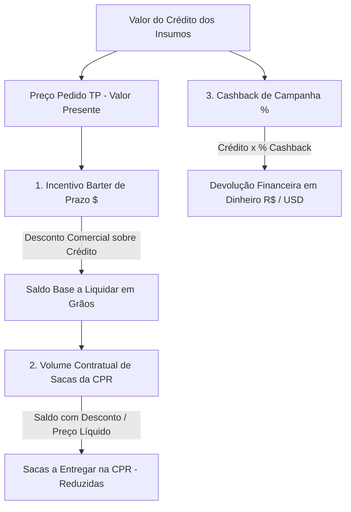

# PRD_SYDE-31 – Simulador de Taxas: Modalidade Barter (Nutrade)

**Versão:** v1.0 (Especificação de Discovery & Negócio para Engenharia)  
**Data:** 31 de agosto de 2026  
**Status Atual:** Pronto para Desenvolvimento (Ready for Dev)  
**Referência Cruzada:** PRD_FIN-12453 | Card Jira: SYDE-31  
**Protótipo Funcional:** [josuejofre.github.io/barter-simulator](https://josuejofre.github.io/barter-simulator)

---

## 📋 Changelog do Documento

| Versão | Data | Autor / Origem | Principais Alterações |
|---|---|---|---|
| **v0.1** | 29/07/2026 | Product Discovery | Primeira versão do PRD em fase de discovery inicial. |
| **v0.2** | 29/07/2026 | Product Discovery | Inclusão de referências ao protótipo, planilha de teste de mesa e consolidação preliminar de regras. |
| **v0.3** | 29/07/2026 | Discovery / Negócio | Ajustes de escopo, fluxo do usuário, obrigatoriedade de commodity/praça para Barter e integração WSys. |
| **v1.0** | **31/08/2026** | **Produto & Negócio (Ata 21/08)** | **Consolidação das Regras de Negócio e Simplificação de Escopo:** 1. **Distinção entre Incentivo e Cashback:** O **Incentivo Barter de prazo** atua como um desconto comercial sobre o saldo da compra e **reduz a quantidade de sacas a entregar na CPR**. O **Cashback da campanha** ($4{,}5\%$) é a **devolução financeira em dinheiro** creditada na conta do produtor. 2. **Foco do PRD em Barter Nutrade:** Especificação exclusiva do motor de Barter Nutrade e sua apresentação no comparativo. 3. **Barter Outras Tradings Fora de Escopo:** Definido como entrega futura. 4. **Origem dos Dados no WSys:** Preço da commodity, tarifas de frete e custos por praça vêm diretamente do WSys. 5. **Eliminação de Dependências Externas:** Dispensada a dependência de feed externo de cotação do dólar (quando dados já são informados na moeda da operação pelo WSys) e removidas integrações de Salesforce/SAP deste escopo. 6. **Identificação de Fontes:** Parametrização dos campos originados do cadastro de campanha (`* Fonte: Cadastro de campanha`). |

---

## 1. Contexto

O simulador atual apoia negociações comerciais ao comparar opções de crédito ao produtor rural no ecossistema Syde. Entretanto, a modalidade **Barter**, especialmente na estrutura **Nutrade**, ainda não está contemplada de forma nativa na experiência do produto.

Na prática, isso faz com que RTVs, consultores e times comerciais dependam de cálculos paralelos e planilhas manuais para demonstrar o ganho econômico da operação ao produtor. O resultado é perda de agilidade, risco operacional e menor capacidade de evidenciar o valor diferencial da estrutura proposta.

Este PRD formaliza a inclusão nativa da modalidade **Barter (Nutrade)** no simulador, tomando como base o protótipo funcional validado e a memória de cálculo homologada via planilha de teste de mesa.

---

## 2. Problema

Hoje não existe, dentro do simulador, uma forma padronizada e auditável de demonstrar o valor da modalidade Barter. Isso gera quatro consequências principais:
- **Dificuldade de comparação** entre a estrutura de Barter e as demais modalidades do produto;
- **Dependência de cálculos manuais** e arquivos auxiliares descentralizados;
- **Risco de inconsistência** entre o discurso comercial e o cálculo financeiro real;
- **Baixa clareza** sobre a mecânica da operação: necessidade de evidenciar que o Incentivo de Prazo abate sacas da CPR e o Cashback é uma devolução financeira em dinheiro na conta do produtor.

---

## 3. Objetivo

Incluir a modalidade **Barter (Nutrade)** no simulador, permitindo a comparação clara e confiável com as modalidades já existentes no produto (**FISO**, **Syngenta** e **Syde**), evidenciando o valor total da operação, volume contratual a entregar na CPR com o desconto de incentivo e a devolução financeira de cashback.

---

## 4. Requisitos Funcionais

### Consumo da Simulação
- **RF-01 (Seleção de Campanha de Referência):** O usuário seleciona a campanha comercial aplicável (ex: *Sul Repique*, *Cerrado Safra 2026/27*), que define o período de carência/vencimento e as taxas vigentes.
- **RF-02 (Seleção de Commodity):** Campo obrigatório para a modalidade Barter (Soja em sacas de 60 kg ou Algodão em libras-peso - lp).
- **RF-03 (Seleção de Moeda):** Seleção entre **BRL (R$)** e **USD ($)**.
- **RF-04 (Valor da Operação):** Entrada do valor total dos insumos a financiar.
- **RF-05 (Estado e Praça Logística):** Seleção obrigatória para Barter, consumindo tarifas e tributos do catálogo WSys.
- **RF-06 (Deduções Fiscais):** Opção de ligar/desligar deduções fiscais para fins comparativos.
- **RF-07 (Dados Logísticos / Frete Flexível):** Distâncias em estrada de chão (KM) e asfalto (KM). O sistema deve permitir **KM zero** (frete R$ 0,00) sem travar a simulação.
- **RF-08 (Cálculo e Comparativo):** Calcular o cenário de Barter (Nutrade) e apresentá-lo no ranking comparativo de modalidades ordenado por melhor benefício.
- **RF-09 (Identificação de Fonte de Campanha):** Exibir a tag `* Fonte: Cadastro de campanha` nos campos parametrizados por campanha (*Taxa mensal, Incentivo Barter, Cashback*).
- **RF-10 (Exportação e Compartilhamento):** Permitir exportação da simulação em PDF e geração de link compartilhável.

### Configuração & Manutenção
- **RF-11 (Integração de Dados WSys):** Consumir do **WSys** a cotação/preço da commodity, as tarifas de frete (R$/KM chão e R$/KM asfalto) e os impostos regionais da praça.
- **RF-12 (Cadastro de Campanhas):** Adequar o cadastro de campanha para parametrizar as taxas de Barter Nutrade (Cashback da campanha, Incentivo de prazo, Taxa de juros anual, prazos e vigência).

---

## 5. Escopo: O que está Dentro e Fora de Escopo

### No Escopo
- Motor de cálculo completo da modalidade **Barter (Nutrade)**.
- Apresentação do Barter (Nutrade) integrado ao comparativo com as modalidades existentes (**Syde**, **Fiso**, **Syngenta**).
- Regra de CPR Física com abatimento do Incentivo de Prazo e devolução financeira em dinheiro do Cashback.
- Consumo dos parâmetros de cotação da commodity, fretes e tributos do catálogo WSys.
- Suporte a operações em Real (BRL) e Dólar (USD).

### Fora de Escopo
- ❌ **Barter (Outras Tradings):** O comparativo com tradings concorrentes está fora do escopo desta entrega e será tratado em fase futura.
- ❌ **Cálculo interno das demais modalidades:** A fórmula matemática interna das modalidades financeiras pré-existentes (Syde, Fiso, Syngenta) já faz parte do produto atual e não compõe o escopo de engenharia deste PRD.
- ❌ **Integração com Salesforce / SAP S/4HANA:** Não faz parte do escopo deste PRD qualquer integração pesada de CRM ou ERP para captura de pedidos ou faturamento.
- ❌ **Feed externo obrigatório de Cotação de Câmbio (Dólar):** Como os dados de commodity, fretes e tributos já são providos na moeda da operação via WSys/cadastro, dispensa-se a dependência de APIs externas de cotação cambial em tempo real.

---

## 6. Especificação Matemática da Modalidade Barter (Nutrade)

### 1. Preço Líquido da Saca (Porteira)
$$\text{Preço Líquido} = \text{Preço Bruto FOB (WSys)} - \text{Impostos da Região (WSys)}$$

### 2. Preço Pedido TP (Valor Presente)
$$\text{Juros do Período} = \left(\frac{\text{Prazo em Dias}}{360}\right) \times \left(\frac{\text{Taxa Anual Barter \%}}{100}\right)$$
$$\text{Preço Pedido TP} = \frac{\text{Valor do Crédito}}{1 + \text{Juros do Período}}$$

### 3. Incentivo de Prazo Barter (Desconto Comercial)
$$\text{Taxa Incentivo Prazo (\%)} = \left(\frac{\text{Prazo em Dias}}{30}\right) \times 0{,}5\%$$
$$\text{Incentivo Barter (\$)} = \text{Preço Pedido TP} \times \left(\frac{\text{Taxa Incentivo Prazo (\%)}}{100}\right)$$

### 4. Volume Contratual de Sacas a Entregar (CPR Física com Desconto de Incentivo)
$$\text{Volume de Sacas da CPR} = \text{Teto}\left(\frac{\text{Valor do Crédito} - \text{Incentivo Barter}}{\text{Preço Líquido da Saca}}\right)$$

> [!IMPORTANT]
> **Incentivo vs. Cashback:**
> - **Incentivo Barter de Prazo:** É um desconto comercial que **diminui o valor base a ser quitado em grãos e reduz as sacas a entregar na CPR**.
> - **Cashback da Campanha ($4{,}5\%$):** É uma **devolução financeira em dinheiro (R$ ou USD)** creditada diretamente na conta do produtor.

### 5. Devolução Financeira de Cashback da Campanha (R$ ou USD)
$$\text{Cashback Financeiro} = \text{Valor do Crédito} \times \left(\frac{\%\text{ Cashback da Campanha}}{100}\right)$$

### 6. Custo do Frete Logístico
$$\text{Frete Total} = (\text{Km Chão} \times \text{Tarifa Chão WSys}) + (\text{Km Asfalto} \times \text{Tarifa Asfalto WSys})$$

### 7. Valor Total da Operação e Custos
$$\text{Valor Total Barter} = (\text{Volume da CPR} \times \text{Preço Bruto FOB WSys}) + \text{Frete Total} - \text{Cashback Financeiro}$$
$$\text{Custo Real Total (\%)} = \left(\frac{\text{Valor Total Barter} - \text{Crédito}}{\text{Crédito}}\right) \times 100$$
$$\text{Custo Real da Operação (\% a.m.)} = \frac{\text{Custo Real Total (\%)}}{\text{Prazo em Dias} / 30}$$

---

## 7. Exemplo Numérico Homologado (Teste de Mesa)

| Parâmetro / Indicador | Valor de Exemplo | Detalhamento |
|---|---|---|
| **Valor da Operação (Crédito)** | USD 1.000.000,00 | Valor total financiado em insumos |
| **Prazo da Safra** | 216 dias | Prazo calculado até o vencimento |
| **Taxa Anual Barter** | 14,40% a.a. | Taxa da campanha |
| **Preço Commodity Bruto FOB (WSys)** | USD 20,00 / sc | Cotação futura WSys |
| **Impostos da Praça (WSys)** | USD 0,64 / sc | Dedução tributária (Campo Novo) |
| **Preço Commodity Livre (Porteira)** | **USD 19,36 / sc** | USD 20,00 - USD 0,64 |
| **Preço Pedido TP (Valor Presente)** | USD 920.471,28 | USD 1.000.000 ÷ (1 + 8,64%) |
| **Incentivo de Prazo Barter (3,6%)** | **USD 33.136,97** | Desconto comercial sobre o saldo |
| **Volume Contratual a Entregar na CPR** | **49.942 sacas** | (USD 1.000.000 - USD 33.136,97) ÷ USD 19,36 *(Com desconto)* |
| **Devolução em Dinheiro de Cashback (4,5%)** | **USD 45.000,00** | USD 1.000.000 × 4,5% *(Devolução Financeira)* |

---

## 8. Critérios de Aceite para Engenharia

- ✅ **CA-01:** O Incentivo de Prazo Barter deve ser deduzido do saldo da operação, reduzindo o volume de sacas a entregar na CPR física: `(Crédito - Incentivo) ÷ Preço Líquido`.
- ✅ **CA-02:** O Cashback ($4{,}5\%$) deve ser creditado e exibido como devolução financeira monetária em dinheiro ($ ou R$).
- ✅ **CA-03:** O sistema deve permitir simulações com frete KM zero sem gerar erros de cálculo.
- ✅ **CA-04:** Os dados de preço da commodity, frete e tributos devem ser consumidos da estrutura do WSys.
- ✅ **CA-05:** Os campos derivados de campanha devem conter o indicador visual `* Fonte: Cadastro de campanha`.
- ✅ **CA-06:** O comparativo deve posicionar o Barter Nutrade junto com as modalidades existentes (Syde, Fiso, Syngenta), ordenado por menor custo real total.
- ✅ **CA-07:** Tolerância zero de divergência matemática contra a planilha de teste de mesa homologada (`Simulador_CashBack_Barter_2026.xlsx`).
