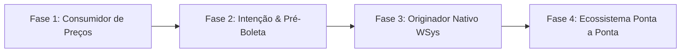

# Documento Técnico & Estratégico: Análise de Integração WSys, Adequações no Simulador e Roadmap do Originador

**Data:** 06 de outubro de 2026  
**Referência da Gravação:** `GMT20261006-175852_Recording_gallery_1920x1080 Wsys`  
**Transcrição de Referência:** [Conhecer o sistema Wsys e campos para a simulação Barter 06 10 2026.txt](file:///c:/Users/jj/OneDrive/Projetos/Barter%20Simulator/Conhecer%20o%20sistema%20Wsys%20e%20campos%20para%20a%20simula%C3%A7%C3%A3o%20Barter%2006%2010%202026.txt)  
**Documentação da API:** *WSys - Preços via API (v1.0 / v2.0 - Wsys Sistemas)*  
**PRD de Referência:** *PRD_SYDE-31 - Simulador de Taxas: Modalidade Barter (Nutrade) - v1.3*  

---

## 📌 Sumário Executivo

Na reunião técnica realizada em **06/10/2026** entre o time de Produto/Engenharia do Syde (Josue Jofre, Aleksander Santos) e a equipe de Operações de Grãos/Barter da Nutrade (Alessandra Monteiro, Mariana Haddad), foi realizada uma imersão prática nas telas operacionais do **WSys** ("Express/Pagamento - Novo Contrato" e "Monitor de Mercado") para entender a mecânica real de precificação, dependências logísticas e o fluxo de formalização de contratos de grãos.

Este documento consolida as respostas detalhadas para as 5 frentes solicitadas:
1. **Alterações necessárias no Simulador Barter**;
2. **Grau de compatibilidade técnica da API do WSys**;
3. **Análise de viabilidade de Scraping (raspagem de dados)**;
4. **Atualizações e pendências a incorporar no PRD (PRD_SYDE-31)**;
5. **Roadmap de evolução do Simulador para atuar como Originador integrado ao WSys**.

---

## 1. Alterações Necessárias no Simulador de Barter

A partir da demonstração das telas do WSys e das particularidades operacionais da mesa de grãos, identificamos os seguintes ajustes fundamentais na experiência, regras e validações do simulador:

### 1.1. Tratamento de Cidades sem Logística Cadastrada (Fallback & Feedback Amigável)
* **Cenário Identificado:** O WSys possui centenas de municípios cadastrados, porém nem todos possuem rota logística/frete ativa ou atualizada (demonstrado em tela quando cidades selecionadas dispararam alertas de falta de rota/frete e travaram o cálculo).
* **Alteração no Simulador:**
  - O simulador não pode quebrar caso a API do WSys retorne erro de falta de logística ou preço indisponível (`ST_PrecoValido: false`).
  - Deve ser implementado um feedback contextual em tela:  
    > *"Não foi possível calcular o preço para a praça selecionada, pois a rota logística não está cadastrada no WSys. Por favor, selecione uma praça polo vizinha ou acione a Mesa de Grãos Nutrade para parametrização da rota."*

### 1.2. Alerta de Horário de Mercado (Fechamento da Bolsa CBOT / Chicago)
* **Cenário Identificado:** Ponto crítico enfatizado por Alessandra: as cotações no WSys são ancoradas dinamicamente na Bolsa de Chicago (CBOT). Fora do horário de pregão (período noturno, fins de semana ou feriados), o sistema perde a referência em tempo real de Chicago ou adota valores defasados, degradando o preço de tela.
* **Alteração no Simulador:**
  - Incluir um **banner/badge informativo de mercado**:  
    `"Mercado Aberto - Cotações em tempo real da CBOT"` vs. `"Mercado Fechado - Cotação de referência do último fechamento"`.
  - Exibir um aviso claro nas simulações e no PDF exportado:  
    > *"Atenção: Os preços de grãos refletem o momento da simulação e estão sujeitos à oscilação da CBOT. Simulações fora do horário comercial representam valores meramente indicativos."*

### 1.3. Amarração com Mês de Embarque / Mês Logístico
* **Cenário Identificado:** No WSys, a cotação futura do grão depende diretamente do **Mês Logístico de Embarque** (ex: Março, Abril, Maio) e não apenas de um dia estático de vencimento. Cotações para Março (`03`) têm prêmios e custos distintos de Abril (`04`).
* **Alteração no Simulador:**
  - O simulador deve inferir o mês de embarque a partir da data de vencimento da campanha (ex: Vencimento em `2027-03-30` $\rightarrow$ Mês Logístico `Mar/27`) ou permitir selecionar a janela de embarque aplicável, garantindo que a requisição ao WSys consulte o lote correto.

### 1.4. Seleção da Melhor Rota Logística de Destino (Santos vs. Paranaguá)
* **Cenário Identificado:** Para uma mesma praça de origem (ex: Primavera do Leste - MT), o WSys calcula diferentes rotas para portos de exportação (Santos e Paranaguá). A mesa de grãos costuma selecionar a rota mais vantajosa (menor frete/melhor netback), que resulta no maior preço para o produtor.
* **Alteração no Simulador:**
  - Ao receber múltiplas rotas válidas da API, o motor deve filtrar e selecionar a rota de destino mais competitiva (maior `VL_PrecoBase` ou `VL_PrecoBRL`), registrando no detalhamento qual porto de destino foi considerado.

### 1.5. Confirmação do KM Adicional (Chão e Asfalto)
* **Validação em Tela:** Confirmou-se que o acréscimo de KM adicional de chão e asfalto é exatamente o redutor de preço que a mesa aplica quando a retirada ocorre na fazenda do produtor (demonstrado em tela quando 50 km asfalto + 50 km chão reduziram o preço de $ 21,99 para $ 21,55).
* **Ajuste no Simulador:** Manter os inputs de KM flexíveis (inclusive suportando KM zero sem travar) e garantir o envio correto dessas distâncias como parâmetros do cálculo de frete.

### 1.6. Inclusão de Campo de Observações Comerciais
* **Cenário Identificado:** Na reunião, foi destacado que o titular do contrato de insumos (ex: PJ da revenda/produtor) frequentemente não é o mesmo titular que entregará os grãos (ex: PF do cooperado ou sócio).
* **Alteração no Simulador:** Incluir campo livre de "Observações da Operação" no fechamento da simulação para que o RTV anote dados cadastrais complementares (CPF/CNPJ do titular dos grãos, fazenda de retirada, etc.), que serão impressos no relatório PDF compartilhado com a mesa.

---

## 2. Compatibilidade Técnica da API do WSys

A documentação técnica da API da WSys (`WSys - Preços via API` v1.0/v2.0) foi minuciosamente confrontada com as necessidades do projeto Syde:

### 2.1. Visão Geral dos Endpoints Avaliados

| Endpoint WSys | Método | Função | Nível de Aderência ao Simulador |
|---|---|---|---|
| `/integracao/loginIntegracao` | `POST` | Autenticação e geração de Bearer Token JWT (validade de 8h). | **100% Compatível** |
| `/integracao/contrato/getProduto` | `GET` | Catálogo de produtos (Soja, Milho, Algodão). | **100% Compatível** |
| `/integracao/contrato/getSafra` | `GET` | Catálogo de safras vigentes (ex: `2526`). | **100% Compatível** |
| `/integracao/contrato/getCidadeEntrega` | `GET` | Catálogo de rotas e praças logísticas cadastradas. | **95% Compatível** |
| `/integracao/contrato/getPrices` | `GET` | Consulta dinâmica de preços, prêmios e fretes por praça. | **85% Compatível** (requer camada BFF) |

### 2.2. Avaliação Detalhada do Endpoint `/integracao/contrato/getPrices`

O endpoint `/getPrices` recebe os seguintes parâmetros:
- `currencyISO`: Moeda da operação (`USD` ou `BRL`).
- `productID`: Código da commodity.
- `pricingName`: Nome do lote parametrizado (ex: `"SOJA 2024/2025 - PORTOS - PARANAGUA - MAR/25 - Soja"`).
- `cityID` / `city`: Identificador e nome da cidade de origem.
- `logisticsTypeName`: Tipo de frete (`FOB` ou `CIF`).
- `startDate` / `endDate`: Janela de datas do embarque.

E retorna um array `PrecosMonitorar` contendo:
- Cotações: `VL_PrecoBRL`, `VL_PrecoBase`, `VL_PrecoPropostoBRL`, `VL_PrecoBaseProposto`.
- Detalhamento de Fretes: `VL_CustoFrete`, `VL_CustoFreteRodo`, `VL_AjusteFrete`, `VL_CustoTotal`.
- Parâmetros logísticos: `KM_AdicionalAsfalto`, `KM_AdicionalChao`.
- Validações: `ST_PrecoValido`, `ST_PrecoCalculado`, `Notificacao`.

### 2.3. Gaps e Pontos de Atenção na API do WSys
1. **Dependência do `pricingName` (Nome do Lote):** A API exige o nome descritivo do lote de precificação. O simulador precisará de um de-para ou consulta prévia para montar esse padrão textual sem expor essa complexidade ao RTV.
2. **Deduções Fiscais Regionais:** O retorno da API consolida os preços livres e custos de transporte, mas as alíquotas tributárias específicas (FETHAB em MT, Fundeagro em GO, etc.) devem continuar orquestradas pela matriz tributária do Syde (conforme homologado no PRD v1.3).
3. **Múltiplos Resultados por Chamada:** Uma única requisição pode retornar diversas opções (portos diferentes, filiais diferentes). O backend do Syde deve conter uma regra simples de seleção da melhor oferta válida (`ST_PrecoValido = true`).

### 2.4. Veredito de Compatibilidade
> **Conclusão:** A API do WSys é **altamente compatível** com o projeto (~85% de aderência direta). Ela elimina completamente a necessidade de inputs manuais de preços e atende integralmente os requisitos de automatização do fluxo de simulação.

---

## 3. Análise de Viabilidade: Raspagem de Dados (Web Scraping)

Na reunião e nas discussões preliminares de escopo, levantou-se a hipótese de utilizar raspagem de dados (robôs automatizados interagindo com o front-end web do WSys).

### 3.1. Diagnóstico Técnico

| Critério | Raspagem de Dados (Web Scraping) | Integração via API REST Oficial |
|---|---|---|
| **Estabilidade** | **Crítica/Baixa:** A interface web do WSys é legada (ASP.NET), com postbacks, modais dinâmicos e dependência de múltiplos cliques. Qualquer ajuste de CSS/HTML quebra o robô. | **Alta:** Contrato de dados estruturado em JSON com versionamento formal. |
| **Tempo de Resposta (Latência)** | **Inviável (15 a 45 segundos):** O robô precisa abrir navegador headless, autenticar, carregar DOM pesado, preencher formulários e aguardar renderização. | **Imediato (< 1 a 2 segundos):** Requisição HTTP direta em JSON. |
| **Escalabilidade & Concorrência** | **Péssima:** Múltiplos RTVs simulando simultaneamente esgotariam a memória de servidores de scraping e causariam bloqueio por concorrência. | **Excelente:** Suporta centenas de requisições paralelas sem gargalos de UI. |
| **Segurança & Governança** | **Inseguro:** Exige credenciais de usuário com privilégios de tela expostas no código, sem auditoria granular e com risco de bloqueio de IP/WAF. | **Seguro:** Autenticação padrão via OAuth/JWT com token temporário e trilha de auditoria formal. |
| **Custo de Manutenção** | **Altíssimo:** Necessidade contínua de correções e monitoramento diário de quebra de robôs. | **Baixo:** Manutenção restrita a alterações documentadas no Swagger da API. |

### 3.2. Conclusão sobre Scraping
> **Recomendação Definitiva: INVIÁVEL e DESACONSELHADO.**  
> O desenvolvimento de uma solução de scraping representaria um desperdício de esforço técnico e criaria uma solução frágil e lenta para os RTVs. Como a WSys **já possui e disponibilizou uma API REST funcional e documentada**, a rota de integração obrigatória e definitiva deve ser a **API REST**.

---

## 4. Atualizações Necessárias no PRD (PRD_SYDE-31)

O PRD atual (versão v1.3 de 17/09/2026) necessita das seguintes atualizações formais para refletir as definições colhidas na reunião de 06/10/2026:

### 4.1. Fechamento da Seção 10 (Estratégia de Integração WSys)
* **No PRD v1.3:** A Seção 10 mantém o status como *"em aberto, avaliando scraping, input manual ou API"*.
* **Atualização para v1.4:**
  - **Descartar formalmente o Web Scraping** por inviabilidade técnica de latência e governança.
  - **Descartar Input Manual como regra geral** (mantê-lo apenas como contingência emergencial).
  - **Homologar a Integração via API REST** como a arquitetura oficial do produto, documentando os endpoints validados (`/loginIntegracao` e `/getPrices`).

### 4.2. Inclusão de Novos Requisitos Funcionais (RFs)
* **Novo RF - Feedback de Praças sem Logística no WSys:**  
  *Especificar que quando a API retornar ausência de rota ou cotação indisponível para o município, a interface deve emitir alerta orientando o usuário a escolher praça alternativa ou acionar o Backoffice/Logística.*
* **Novo RF - Governança de Cotação e Horário de Mercado (CBOT):**  
  *Adicionar disclaimer de mercado e indicador visual de cotação de referência fora do horário de pregão.*
* **Novo RF - Campo de Observações da Proposta:**  
  *Disponibilizar campo de anotações comerciais para preservar dados do produtor/grão na exportação em PDF.*

### 4.3. Ajuste nos Critérios de Aceite para Engenharia
* **CA-13 (Revisão):** Definir o consumo direto da API REST `/getPrices`, mapeando os identificadores `cityID`, `productID`, `currencyISO` e `logisticsTypeName`.
* **Novo CA - Tolerância e Tratamento de Erros de API:** Garantir que erros `4xx`/`5xx` ou retornos com `ST_PrecoValido: false` não interrompam a aplicação nem travem a simulação das demais modalidades (Syde, Fiso, Syngenta).

---

## 5. Roadmap de Evolução: Do Simulador ao Originador de Contratos

Atualmente, o simulador funciona como uma **ferramenta consultiva de tomada de decisão** (evitando que o RTV precise ligar para a mesa apenas para cotar). O objetivo estratégico alinhado com Josue e Alessandra é evoluí-lo para uma **plataforma originadora de negócios de Barter**.

Abaixo, o roadmap estruturado em 4 fases:

### Fase 1: Consumidor Automatizado de Preços (MVP Atual - Q4/2026)
* **Objetivo:** Automatizar a entrada de dados do simulador sem dependência de ligações para a mesa.
* **Escopo:**
  - Consumo da API `/getPrices` do WSys via backend do Syde (BFF).
  - Cálculo das fórmulas homologadas de Barter (Cashback em dinheiro + Incentivo de Prazo + CPR Física).
  - Alertas de mercado e tratamento amigável de praças sem rota cadastrada.
  - Geração de PDF e link compartilhável com campo de observações.
* **Fluxo Operacional:** O RTV simula e envia o PDF para a mesa fechar manualmente no WSys.

### Fase 2: Geração de Intenção de Contratação / Pré-Boleta (Q1/2027)
* **Objetivo:** Reduzir o retrabalho de redigitação da mesa de grãos após o aceite do produtor.
* **Escopo:**
  - Adição do botão no simulador: *"Solicitar Trava de Barter"*.
  - Formulário simplificado de dados contratuais capturados no front:
    - Dados do vendedor do grão (Nome, CPF/CNPJ, Inscrição Estadual);
    - Filial Nutrade aplicável;
    - Local de retirada (Fazenda ou Armazém);
    - Modalidade de negócio (Hedge/Trade).
  - Notificação estruturada disparada para a mesa da Nutrade (via Webhook, e-mail padronizado ou fila interna) contendo a boleta pré-preenchida.

### Fase 3: Originador Nativo Bidirecional com o WSys (Q2/2027)
* **Objetivo:** Inserção direta da contratação no WSys sem intervenção manual na digitação.
* **Escopo:**
  - Integração com endpoint de criação de contratos do WSys (ex: `POST /integracao/contrato/novoContrato` a ser fornecido/liberado pela WSys Sistemas).
  - Gravação automática da pré-boleta no WSys diretamente pelo Syde.
  - O operador da mesa de grãos apenas revisa e aprova o contrato gerado no WSys com um clique.
  - Retorno do número do contrato do WSys para a tela do Syde.

### Fase 4: Ecossistema Integrado Ponta a Ponta (H2/2027)
* **Objetivo:** Conciliação automática entre a compra de insumos, a emissão da CPR e a venda dos grãos.
* **Escopo:**
  - Amarrações automáticas com Salesforce / SAP S/4HANA (pedidos de insumos).
  - Liquidação financeira automática do Cashback na conta do produtor.
  - Custódia e registro eletrônico da CPR física no ecossistema Syde vinculado ao contrato do WSys.

---

## 🎯 Próximos Passos Imediatos

1. **Aprovação da Versão v1.4 do PRD:** Atualizar formalmente o PRD_SYDE-31 com o descarte do scraping e homologação da API REST.
2. **Alinhamento com WSys Sistemas (Kauê Baro / Suporte):**
   - Solicitar credenciais de homologação da API `/integracao/loginIntegracao` e `/getPrices`;
   - Validar a regra de formação da string `pricingName` utilizada no endpoint `/getPrices`;
   - Confirmar se já existe no roadmap da WSys o endpoint para criação de contratos (`novoContrato`).
3. **Implementação do Backend Proxy (BFF Syde):** Construir o microserviço de consulta e cache de preços para blindar o front-end e gerenciar os tokens de 8 horas.
