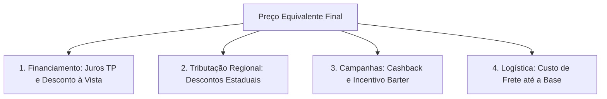
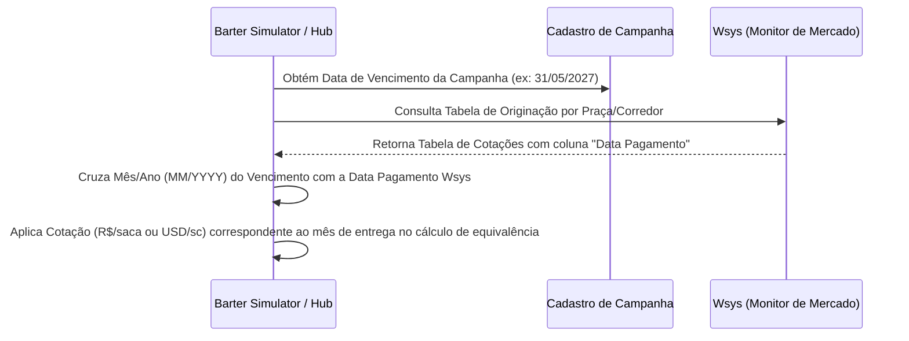

# Regras de Negócio - Simulador Barter 2026

Este documento detalha as regras de negócio e fórmulas matemáticas utilizadas no **Simulador de Cashback Barter 2026**, baseando-se nas colunas A e B da planilha `Simulador_CashBack_Barter_2026.xlsx`, adaptadas para permitir a simulação em **Dólar (USD)** ou **Real (BRL)** e a dedução logística de frete.

A ferramenta demonstra ao produtor rural o valor agregado da modalidade de Barter com a **Nossa Estrutura** em comparação com as práticas de mercado (**Outras Tradings**). O foco é evidenciar como o crédito contratado se reverte em economia física de grãos entregues.

---

## 1. Estrutura Geral dos Benefícios

O simulador unifica as vantagens estruturais do Barter Hub divididas em quatro fatores de impacto financeiro:

1. **Juros e Estruturação Financeira**: Desconto da taxa de juros a prazo para obtenção do Preço Pedido TP (Valor Presente).
2. **Descontos Tributários Regionais**: Dedução de impostos estaduais incidentes sobre o barter de grãos (como Fethab/Senar em MT, Fundeagro in GO e Fundems em MS).
3. **Cashback e Incentivo Barter**: Retornos comerciais de campanha percentuais sobre o crédito contratado.
4. **Logística (Custo de Transporte)**: O frete da propriedade do produtor até a respectiva base logística de recebimento da trading.

---

## ⚡ Fórmula Simplificada do Barter (Passo a Passo)

## ⚡ Fórmula Simplificada do Barter e Devolução Financeira (Passo a Passo)

A mecânica de cálculo da operação de Barter com Devolução de Cashback financeiro é compreendida nos seguintes passos:

1. **Preço Líquido da Saca:**
   $$\text{Preço Bruto da Soja} - \text{Impostos da Região (Funrural + Taxas Estaduais)} = \text{Preço Líquido da Saca}$$
   *(Ex: $\text{R\$\ } 120{,}00 - (\text{R\$\ } 120{,}00 \times 1{,}63\% + \text{R\$\ } 3{,}09) = \text{R\$\ } 114{,}95/\text{sc}$)*

2. **Custo do Frete Logístico:**
   $$(\text{Km Asfalto} \times \text{Custo/Km}) + (\text{Km Chão} \times \text{Custo/Km}) = \text{Frete Total}$$
   *(Ex: $(80 \times \text{R\$\ } 8{,}00) + (20 \times \text{R\$\ } 15{,}00) = \text{R\$\ } 940{,}00$)*

3. **Quantidade de Sacas Contratuais a Entregar:**
   $$\text{Valor do Crédito dos Insumos} \div \text{Preço Líquido da Saca} = \text{Sacas a Entregar}$$
   *(Ex: $\text{R\$\ } 1.000.000{,}00 \div \text{R\$\ } 114{,}95 = 8.699\text{ sacas}$)*
   *Nota Operacional (Ata 21/08): O volume físico de grãos a entregar não é reduzido na CPR, pois o produtor liquida a totalidade dos insumos com grãos.*

4. **Devolução Financeira de Cashback da Campanha (R$ ou USD):**
   $$\text{Valor do Crédito} \times \%\text{ de Cashback} = \text{Devolução Financeira (R\$)}$$
   *(Ex: $\text{R\$\ } 1.000.000{,}00 \times 4{,}5\% = \mathbf{R\$\ 45.000{,}00\text{ devolvidos ao produtor}}$)*

5. **Incentivo de Prazo Barter (R$ ou USD):**
   $$\text{Valor Presente TP} \times (\text{Dias de Prazo} \div 30 \times 0{,}5\%) = \text{Incentivo de Prazo (R\$)}$$
   *(Ex: $\text{R\$\ } 920.471{,}28 \times 3{,}6\% = \mathbf{R\$\ 33.136{,}97}$)*

6. **Benefício Total Devolvido ao Produtor:**
   $$\text{Devolução Cashback} + \text{Incentivo Barter} = \text{Retorno Financeiro Total}$$
   *(Ex: $\text{R\$\ } 45.000{,}00 + \text{R\$\ } 33.136{,}97 = \mathbf{R\$\ 78.136{,}97}$)*

7. **Sacas Equivalentes à Devolução:**
   $$\text{Retorno Financeiro Total} \div \text{Preço Líquido da Saca} = \text{Sacas Equivalentes Economizadas}$$
   *(Ex: $\text{R\$\ } 78.136{,}97 \div \text{R\$\ } 114{,}95 = 680\text{ sacas equivalentes}$)*

---

## 2. Seleção de Moeda (Real R$ vs. Dólar USD)

O simulador permite definir a moeda padrão da operação:
* **Ao selecionar Real (R$):** Todas as entradas e saídas monetárias operam em BRL (R$).
* **Ao selecionar Dólar (USD):** Todas as entradas e saídas monetárias operam em USD ($).

---

## 3. Matriz de Impostos Regionais (Praças - Planilha "Impostos 1")

Para cada estado e praça logística, o simulador calcula a dedução tributária combinando tributos federais e estaduais:

* **Funrural Federal:** $1,63\%$ sobre a comercialização bruta.
* **Mato Grosso (MT):** Funrural ($1,63\%$) + FETHAB ($10\%$ UPF/MT) + FETHAB Adicional ($10\%$ UPF/MT) + IAGRO ($1,15\%$ UPF/MT).
  - Com UPF|MT em $\text{R\$\ } 243,49/\text{ton} \rightarrow \text{R\$\ } 51,50/\text{ton}$ ($\approx \text{R\$\ } 3,09/\text{sc}$).
* **Mato Grosso do Sul (MS):** Funrural ($1,63\%$) + FUNDEMS ($2,8\%$ UFERMS) + FUNDERSUL ($49,20\%$ UFERMS).
  - Com UFERMS em $\text{R\$\ } 52,98/\text{ton} \rightarrow \text{R\$\ } 27,55/\text{ton}$ ($\approx \text{R\$\ } 1,65/\text{sc}$).
* **Goiás (GO):** Funrural ($1,63\%$) + FUNDEINFRA ($1,65\%$ sobre a NF).
* **Piauí (PI):** Funrural ($1,63\%$) + FDI ($1,20\%$ sobre a NF).
* **Paraná (PR), Bahia (BA), Rondônia (RO), Maranhão (MA), Tocantins (TO), São Paulo (SP), Minas Gerais (MG), Rio Grande do Sul (RS):** Funrural ($1,63\%$).

---

## 4. Custo de Transporte (Frete)

O frete da fazenda até a base logística cadastrada no WSys é deduzido:
$$\text{Custo de Frete Total} = (\text{Km Chão} \times \text{Tarifa Chão}) + (\text{Km Asfalto} \times \text{Tarifa Asfalto})$$

---

## 5. Comparativo das 4 Modalidades Ativas de Crédito e Sacas Equivalentes

O simulador compara 4 modalidades de crédito: **Barter (Nutrade)**, **Syde (FIDC)**, **Fiso (Bancário)** e **Syngenta (On-Balance)**.

### Sacas Equivalentes nas Modalidades Financeiras
Para permitir a comparação direta com o Barter, cada modalidade financeira exibe a equivalência em sacas:
$$\text{Sacas Equivalentes} = \frac{\text{Valor Total da Modalidade (R\$)}}{\text{Preço de Referência da Saca (R\$/sc)}}$$

### Conceitos de Custo:
1. **Custo Real Total (%):**
   $$\text{Custo Real Total (\%)} = \left(\frac{\text{Valor Total} - \text{Crédito Demandado}}{\text{Crédito Demandado}}\right) \times 100$$
2. **Custo Real da Operação (% a.m.):**
   $$\text{Custo Real da Operação (\% a.m.)} = \frac{\text{Custo Real Total (\%)}}{\text{Prazo em Meses Corridos (dias / 30)}}$$

### Detalhamento das 4 Modalidades Ativas:

1. **Barter (Nutrade):**
   - **Garantias:** CPR Física e Seguro Agrícola.
   - **Mecânica:** Entrega física de grãos com devolução financeira de Cashback ($4,5\%$) e Incentivo de prazo.

2. **Syde:**
   - **Garantias:** Nota promissória ou CPR financeira sem penhor.
   - **Mecânica:** Desconto VPAN à vista de $-4,0\%$, juros compostos em dias úteis (/22).

3. **FISO:**
   - **Garantias:** Sem garantia patrimonial (cessão comercial a parceiro).
   - **Mecânica:** Juros simples em dias corridos com rebate de incentivo comercial ($-3,0\%$).

4. **Syngenta:**
   - **Garantias:** Alinhadas diretamente com a mesa de crédito corporativa.
   - **Mecânica:** Faturamento a prazo On-Balance sobre preço de tabela.
   - **Garantias Exigidas:** CPR Física e Seguro Agrícola.
   - **Incentivos:** Valorização comercial padrão de mercado concorrente.

3. **FISO:**
   - **Garantias Exigidas:** Não há garantia. É uma venda a prazo cedida a um parceiro.
   - **Incentivos:** Venda a prazo dentro de uma campanha comercial com rebate/incentivo comercial (-3,0%).

4. **Syngenta:**
   - **Garantias Exigidas:** Garantia alinhada diretamente com o time de crédito.
   - **Incentivos:** Faturamento direto no balanço Syngenta (On-Balance) sob preço de tabela.

5. **Syde:**
   - **Garantias Exigidas:** Nota promissória ou CPR financeira sem penhor.
   - **Incentivos:** Desconto VPAN à vista de $-4,0\%$ com juros compostos calculados por dias úteis.

---

## 7. Notas sobre Fontes de Dados e Integração em Produção (Pendências)

Para a validação conceitual (protótipo), são utilizadas fontes públicas e simuladas. Para a versão final de produção integrada aos sistemas internos, as seguintes origens de dados devem ser configuradas:

1. **Cotação de Commodities (Soja e Algodão) em Produção:**
   - Deverá ser integrada a um feed profissional contratado, como a **CMA**, **Bloomberg**, **Reuters**, ou diretamente de fontes locais de liquidez como o **CEPEA/Esalq e Safras & Mercado**.
   - *No Protótipo:* Buscamos o preço em tempo real de Chicago (CBOT:ZS=F para Soja e NYCE:CT=F para Algodão) via nosso servidor local de proxy no Yahoo Finance, com fallback estático para USD 20,00 e USD 0,85 respectivamente quando hospedado de forma estática (como no GitHub Pages).

2. **Cotação do Dólar (Câmbio BRL/USD) em Produção:**
   - Deverá integrar-se à API oficial do **Banco Central do Brasil (BACEN)** para obter a taxa **PTAX de fechamento/venda**, ou feeds de câmbio futuro da **B3** (contrato de dólar futuro) se a liquidação for a termo.
   - *No Protótipo:* Buscamos a taxa em tempo real através da AwesomeAPI (economia.awesomeapi.com.br/last/USD-BRL) diretamente pelo navegador do usuário (com CORS liberado, sem necessidade de backend ou chaves expostas). O timestamp da última captura do dólar é atualizado dinamicamente logo abaixo do campo de câmbio. Se a API estiver inacessível, o sistema usa o valor de fallback cambial de R$ 5,1500.

---

## 8. Cruzamento de Preço de Commodity Wsys por Vencimento da Campanha

No sistema **Wsys (Monitor de Mercado / Originação Syngenta)**, os preços praticados para commodities agrícolas (Soja, Milho e Algodão) são exibidos de acordo com a **Data de Pagamento** (data em que o produto físico de fato precisa ser entregue e liquidado na base logística).

### Regra de Negócio e Algoritmo de Cruzamento:
1. **Identificação do Vencimento da Campanha**: Cada campanha de crédito possui uma `Data de Vencimento` pré-definida (ex: `31/05/2027`).
2. **Filtro Temporal no Wsys por Mês**: O sistema realiza a busca na grade de preços do Wsys filtrando pela coluna `Data Pagamento` cujo Mês/Ano coincida com a `Data de Vencimento` da campanha.
3. **Mapeamento de Preço**:
   - Exemplo 1: Campanha com Vencimento em **Maio/2027** (`31/05/2027`) $\rightarrow$ Cruza com Wsys `Data Pagamento = 31/05/2027` $\rightarrow$ Cotação: **R$ 128,27/sc**.
   - Exemplo 2: Campanha com Vencimento em **Abril/2027** (`30/04/2027`) $\rightarrow$ Cruza com Wsys `Data Pagamento = 30/04/2027` $\rightarrow$ Cotação: **R$ 125,42/sc**.
   - Exemplo 3: Campanha com Vencimento em **Março/2027** (`31/03/2027`) $\rightarrow$ Cruza com Wsys `Data Pagamento = 31/03/2027` $\rightarrow$ Cotação: **R$ 123,70/sc**.
   - Exemplo 4: Campanha com Vencimento em **Fevereiro/2027** (`01/02/2027`) $\rightarrow$ Cruza com Wsys `Data Pagamento = 01/02/2027` $\rightarrow$ Cotação: **R$ 126,75/sc**.
4. **Fallback e Ajuste**: Caso a data exata não conste na tabela, utiliza-se a cotação da `Data Pagamento` no mesmo mês ou no mês útil mais próximo imediatamente anterior ao vencimento da campanha.

