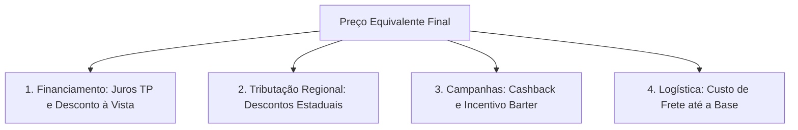
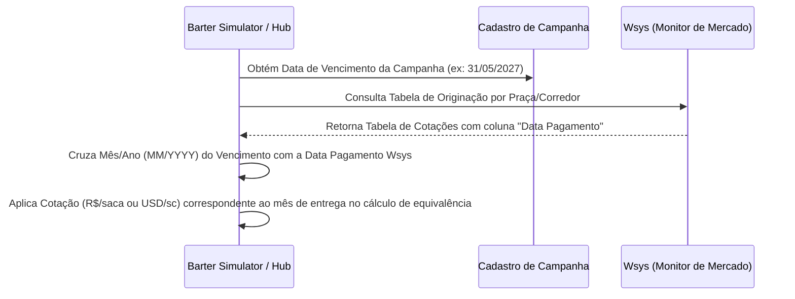

# Regras de Negócio - Simulador Barter 2026

Este documento detalha as regras de negócio e fórmulas matemáticas utilizadas no **Simulador de Cashback Barter 2026**, baseando-se nas colunas A e B da planilha `Simulador_CashBack_Barter_2026.xlsx`, adaptadas para permitir a simulação em **Dólar (USD)** ou **Real (BRL)** e a dedução logística de frete.

A ferramenta demonstra ao produtor rural o valor agregado da modalidade de Barter com a **Nossa Estrutura** em comparação com as práticas de mercado (**Outras Tradings**). O foco é evidenciar como o crédito contratado se reverte em economia física de grãos entregues.

---

## 1. Estrutura Geral dos Benefícios

O simulador unifica as vantagens estruturais do Barter Hub divididas em quatro fatores de impacto financeiro:

1. **Juros e Estruturação Financeira**: Desconto da taxa de juros a prazo para obtenção do Preço Pedido TP (Valor Presente).
2. **Descontos Tributários Regionais**: Dedução de impostos estaduais incidentes sobre o barter de grãos (como Fethab/Senar em MT, Fundeagro in GO e Fundems em MS).
3. **Cashback e Incentivo Barter**: Retornos comerciais de campanha percentuais sobre o crédito contratado.
4. **Logística (Custo de Transporte)**: O frete da propriedade do produtor até a respectiva base logística de recebimento da trading.

---

## 2. Seleção de Moeda (Real R$ vs. Dólar USD)

O simulador permite definir a moeda padrão da operação. O sistema converte automaticamente as entradas usando a **Taxa Cambial Futura (BRL/USD)** configurada:

* **Ao selecionar Real (R$):**
  - O crédito contratado é definido em BRL (ex: `R$ 1.000.000,00`).
  - O preço da commodity e o valor de frete por KM são digitados em BRL.
  - Para o cálculo matemático (que usa a base estruturada em USD da planilha), convertemos:
    $$Credito\_(USD) = \frac{Credito\_(BRL)}{C\hat{a}mbio}$$
    $$Pre\c{c}o\_Commodity\_(USD) = \frac{Pre\c{c}o\_Commodity\_(BRL)}{C\hat{a}mbio}$$
  - Após os cálculos, os resultados monetários da tabela de comparação e dos cartões de destaque são multiplicados pelo câmbio e exibidos em Real (R$).
* **Ao selecionar Dólar (USD):**
  - Todas as entradas e saídas permanecem em USD ($).

*Nota: Os volumes físicos de commodities (sacas ou libras) não se alteram pela moeda selecionada, garantindo a integridade dos volumes da planilha.*

---

## 3. Detalhamento das Regras de Impostos Regionais (Praças)

Para simular o desconto tributário, o sistema calcula a dedução com base na região/praça selecionada:

* **Campo Novo do Parecis (MT)**:
  $$Imposto = (Pre\c{c}o\_Bruto \times 0,2\%) + 0,60\ / saca$$
* **Sorriso (MT)**:
  $$Imposto = (Pre\c{c}o\_Bruto \times 0,25\%) + 0,65\ / saca$$
* **Querência (MT)**:
  $$Imposto = (Pre\c{c}o\_Bruto \times 0,22\%) + 0,70\ / saca$$
* **Rio Verde (GO)**:
  $$Imposto = (Pre\c{c}o\_Bruto \times 0,15\%) + 0,40\ / saca$$
* **Dourados (MS)**:
  $$Imposto = (Pre\c{c}o\_Bruto \times 0,10\%) + 0,30\ / saca$$
* **Cascavel (PR)**:
  $$Imposto = 0.00\ (Isento\ de\ taxas\ de\ Barter)$$

---

## 4. Custo de Transporte (Frete)

O custo logístico de buscar a commodity na propriedade e entregar na nossa base ou na do concorrente é deduzido do preço final do produto (Porteira Aberta):

1. **Custo de Frete Total:**
   $$Custo\_Frete\_Total = Dist\hat{a}ncia\_Base\_(KM) \times Valor\_KM$$
2. **Custo de Frete Unitário:**
   $$Frete\_Unitario = \frac{Custo\_Frete\_Total}{Volume\_Comercializado}$$

---

## 5. Fórmulas de Simulação por Crédito

Calcula a equivalência de troca física para amortizar um financiamento/crédito fixado a prazo (ex. **USD 1.000.000,00** ou **R$ 1.000.000,00**):

1. **Preço Pedido TP (Valor Presente):**
   $$Juros\_Periodo = \frac{Dias}{360} \times Juros\_Anual\_(14,40\%)$$
   $$Pre\c{c}o\_TP = \frac{Credito}{1 + Juros\_Periodo}$$
   *Exemplo para USD 1.000.000,00 e 216 dias:* $\frac{1.000.000}{1 + 8,64\%} = \mathbf{USD\ 920.471,28}$

2. **Retorno Total do Produtor:**
   Soma da valorização da campanha (4,5% sobre crédito) e do incentivo Barter (proporcional ao prazo sobre Preço TP).
   $$Cashback = Credito \times 4,5\% = \mathbf{USD\ 45.000,00}$$
   $$Incentivo\_Barter = Pre\c{c}o\_TP \times \left(\frac{Dias}{30} \times 0,5\%\right) = \mathbf{USD\ 33.136,97}$$
   $$Total\_Retorno = 45.000 + 33.136,97 = \mathbf{USD\ 78.136,97}$$

3. **Preço Equivalente Final com Descontos e Frete:**
   $$Pre\c{c}o\_Livre = Pre\c{c}o\_Bruto - Imposto\_Regi\tilde{a}o$$
   $$Pre\c{c}o\_Equiv\_Final = Pre\c{c}o\_Livre + Cashback\_Unitario + Incentivo\_Unitario - Frete\_Unitario$$
   *Exemplo Campo Novo (MT) na nossa estrutura:*
   $$19,36 + 0,8712 (cb) + 0,6415 (inc) - 0,0019 (frete) = \mathbf{USD\ 20,8708\ / sc}$$

4. **Volume de Troca Equivalente Final:**
   $$Volume\_Troca\_Final = Volume\_Inicial - (Equival\hat{e}ncia\_Cashback + Equival\hat{e}ncia\_Incentivo)$$
   *Exemplo:* $51.652,89 - (2.324,38 + 1.711,62) = \mathbf{47.616,89\ sacas}$
   *Diferença para Outras Tradings (Volume Economizado):* $\mathbf{1.278,91\ sacas}$.

5. **Benefício Financeiro Total da Estrutura (Barter Hub):**
   Representa a economia em volume físico convertida em moeda (BRL/USD) com base no preço bruto de spot da commodity:
   $$Beneficio\_Financeiro = Volume\_Economizado \times Pre\c{c}o\_Bruto$$
   *Exemplo:* $1.278,91\ sacas \times USD\ 20,00 = \mathbf{USD\ 25.578,20}$

---

## 6. Comparativo das 5 Modalidades de Crédito e Desconto VPAN

O simulador apresenta o comparativo ordenado por benefício financeiro entre 5 modalidades de crédito: **Barter (Nutrade)**, **Barter (Outras Tradings)**, **FISO**, **Syngenta** e **Syde**.

*Nota de Apresentação:* A opção de menor custo recebe um destaque visual de borda verde, porém sem o selo fixo "Melhor Opção", reconhecendo que a viabilidade técnica e financeira de cada modalidade depende das condições operacionais e garantias disponíveis de cada produtor.

### Conceito de Desconto VPAN (Desconto à Vista)
* **O que é o Desconto VPAN?** VPAN é a sigla para **Valor Presente À Vista** (Desconto à vista). Representa a dedução percentual concedida para liquidação antecipada/à vista sobre o valor bruto contratado da operação:
  $$Valor\_Intermediario = Credito \times (1 - VPAN\%)$$
  $$Total\_a\_Pagar\_Financeiro = Valor\_Intermediario \times (1 + Taxa\_Mensal \times MesesCalculo) \times (1 - Incentivo\%)$$
* Na modalidade **Syde**, o simulador contabiliza o desconto VPAN à vista (ex: $4,0\%$ à vista), reduzindo o saldo base devedor antes da incidência dos juros.

### Detalhamento das Modalidades e Garantias Exigidas

1. **Barter (Nutrade):**
   - **Garantias Exigidas:** CPR Física e Seguro Agrícola.
   - **Incentivos:** Cashback de campanha ($4,5\%$) + Incentivo Barter regressivo de prazo.

2. **Barter (Outras Tradings):**
   - **Garantias Exigidas:** CPR Física e Seguro Agrícola.
   - **Incentivos:** Valorização comercial padrão de mercado concorrente.

3. **FISO:**
   - **Garantias Exigidas:** Não há garantia. É uma venda a prazo cedida a um parceiro.
   - **Incentivos:** Venda a prazo dentro de uma campanha comercial com rebate/incentivo comercial (-3,0%).

4. **Syngenta:**
   - **Garantias Exigidas:** Garantia alinhada diretamente com o time de crédito.
   - **Incentivos:** Faturamento direto no balanço Syngenta (On-Balance) sob preço de tabela.

5. **Syde:**
   - **Garantias Exigidas:** Nota promissória ou CPR financeira sem penhor.
   - **Incentivos:** Desconto VPAN à vista de $-4,0\%$ com juros compostos calculados por dias úteis.

---

## 7. Notas sobre Fontes de Dados e Integração em Produção (Pendências)

Para a validação conceitual (protótipo), são utilizadas fontes públicas e simuladas. Para a versão final de produção integrada aos sistemas internos, as seguintes origens de dados devem ser configuradas:

1. **Cotação de Commodities (Soja e Algodão) em Produção:**
   - Deverá ser integrada a um feed profissional contratado, como a **CMA**, **Bloomberg**, **Reuters**, ou diretamente de fontes locais de liquidez como o **CEPEA/Esalq e Safras & Mercado**.
   - *No Protótipo:* Buscamos o preço em tempo real de Chicago (CBOT:ZS=F para Soja e NYCE:CT=F para Algodão) via nosso servidor local de proxy no Yahoo Finance, com fallback estático para USD 20,00 e USD 0,85 respectivamente quando hospedado de forma estática (como no GitHub Pages).

2. **Cotação do Dólar (Câmbio BRL/USD) em Produção:**
   - Deverá integrar-se à API oficial do **Banco Central do Brasil (BACEN)** para obter a taxa **PTAX de fechamento/venda**, ou feeds de câmbio futuro da **B3** (contrato de dólar futuro) se a liquidação for a termo.
   - *No Protótipo:* Buscamos a taxa em tempo real através da AwesomeAPI (economia.awesomeapi.com.br/last/USD-BRL) diretamente pelo navegador do usuário (com CORS liberado, sem necessidade de backend ou chaves expostas). O timestamp da última captura do dólar é atualizado dinamicamente logo abaixo do campo de câmbio. Se a API estiver inacessível, o sistema usa o valor de fallback cambial de R$ 5,1500.

---

## 8. Cruzamento de Preço de Commodity Wsys por Vencimento da Campanha

No sistema **Wsys (Monitor de Mercado / Originação Syngenta)**, os preços praticados para commodities agrícolas (Soja, Milho e Algodão) são exibidos de acordo com a **Data de Pagamento** (data em que o produto físico de fato precisa ser entregue e liquidado na base logística).

### Regra de Negócio e Algoritmo de Cruzamento:
1. **Identificação do Vencimento da Campanha**: Cada campanha de crédito possui uma `Data de Vencimento` pré-definida (ex: `31/05/2027`).
2. **Filtro Temporal no Wsys por Mês**: O sistema realiza a busca na grade de preços do Wsys filtrando pela coluna `Data Pagamento` cujo Mês/Ano coincida com a `Data de Vencimento` da campanha.
3. **Mapeamento de Preço**:
   - Exemplo 1: Campanha com Vencimento em **Maio/2027** (`31/05/2027`) $\rightarrow$ Cruza com Wsys `Data Pagamento = 31/05/2027` $\rightarrow$ Cotação: **R$ 128,27/sc**.
   - Exemplo 2: Campanha com Vencimento em **Abril/2027** (`30/04/2027`) $\rightarrow$ Cruza com Wsys `Data Pagamento = 30/04/2027` $\rightarrow$ Cotação: **R$ 125,42/sc**.
   - Exemplo 3: Campanha com Vencimento em **Março/2027** (`31/03/2027`) $\rightarrow$ Cruza com Wsys `Data Pagamento = 31/03/2027` $\rightarrow$ Cotação: **R$ 123,70/sc**.
   - Exemplo 4: Campanha com Vencimento em **Fevereiro/2027** (`01/02/2027`) $\rightarrow$ Cruza com Wsys `Data Pagamento = 01/02/2027` $\rightarrow$ Cotação: **R$ 126,75/sc**.
4. **Fallback e Ajuste**: Caso a data exata não conste na tabela, utiliza-se a cotação da `Data Pagamento` no mesmo mês ou no mês útil mais próximo imediatamente anterior ao vencimento da campanha.

